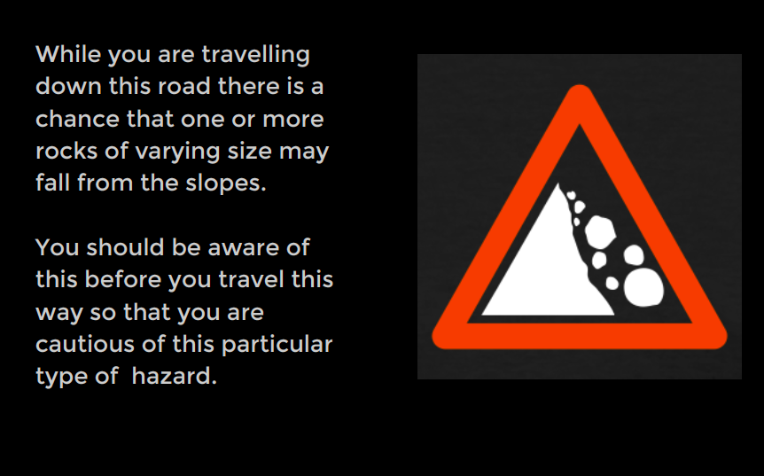
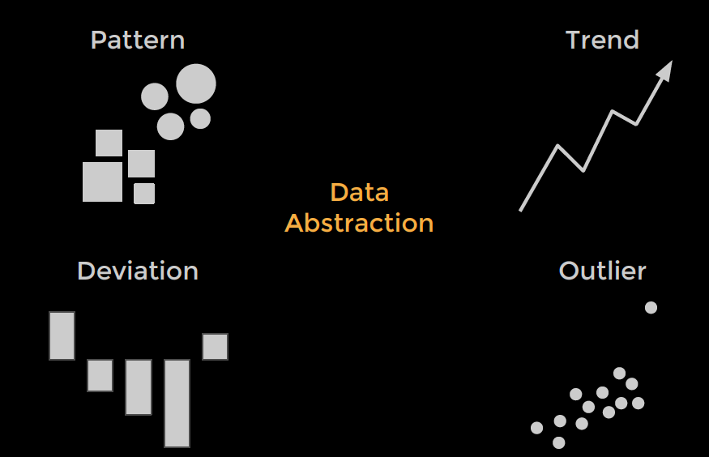
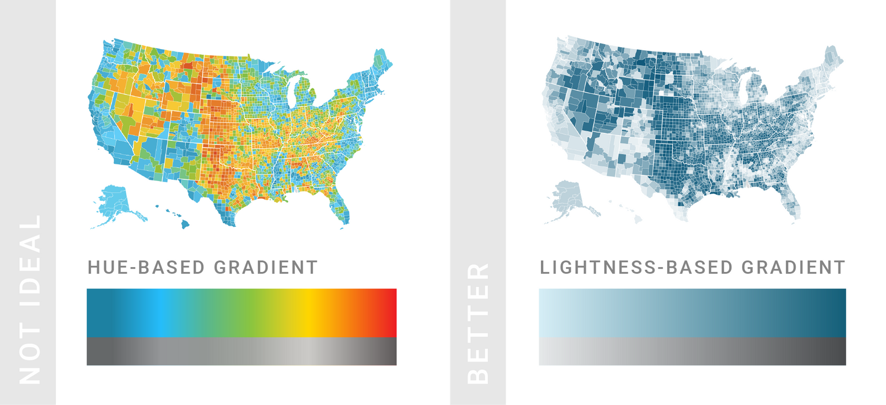
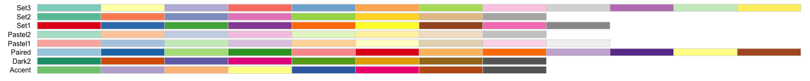
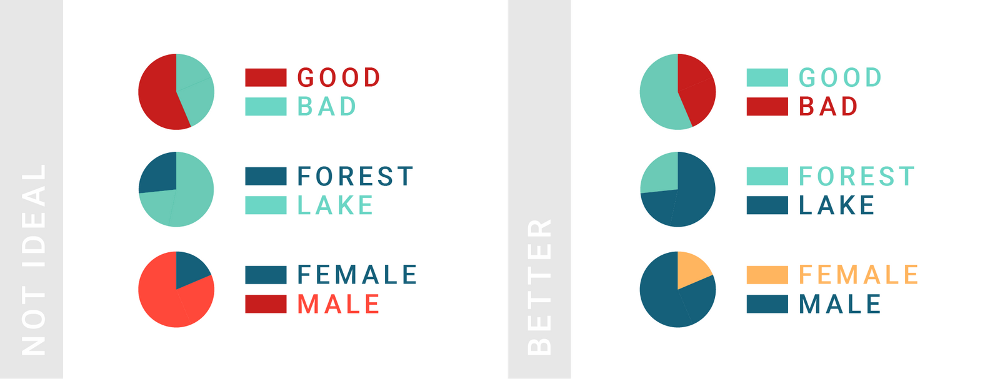
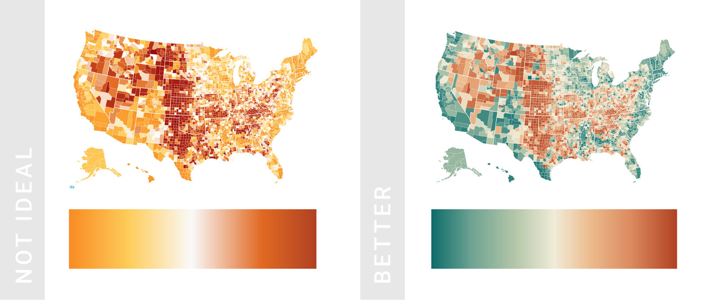
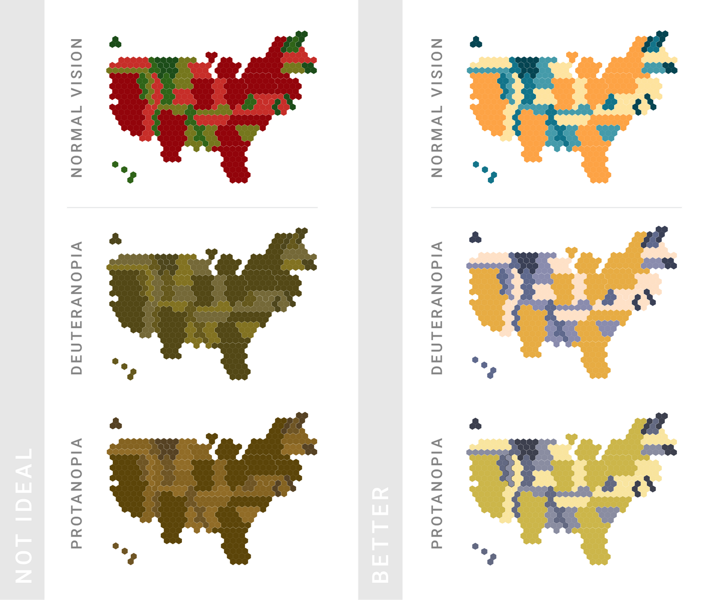
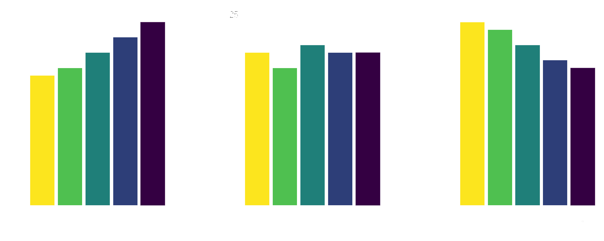
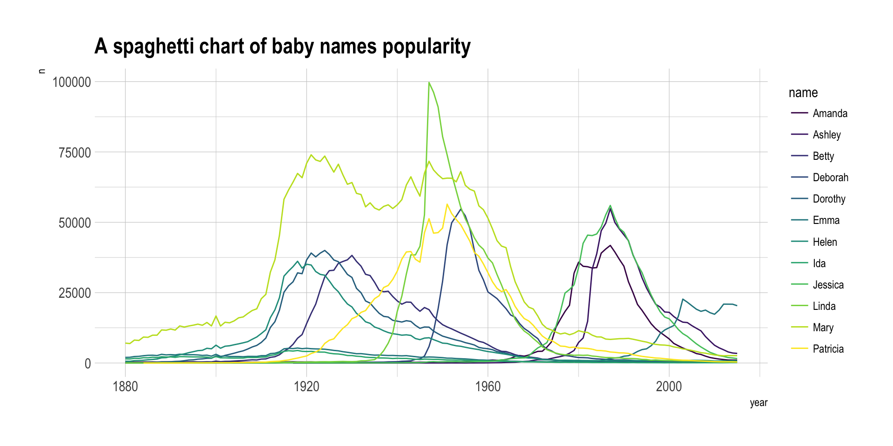
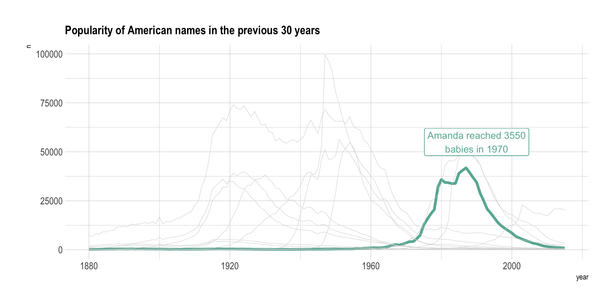

## Designing Effective Data Visualizations


UC Berkeley Library 

`r format(Sys.time(), "%B %Y")`

<aside class="notes">
		Oh hey, these are some notes. They'll be hidden in your presentation, but you can see them if you open the speaker notes window (hit »S« on your keyboard).
	</aside>

--------


## Goals

1. Why Visualize?
2. Design Considerations
3. Resources 
4. Jupyter Notebook
5. Hands-on critique activity


## Why Visualize? {data-background=#000000}


## Why Visualize? {data-background=#000000}





<aside class="notes">
	to really drive the point home - for those of you who drive - you can understand why the sign on the right would be more effective than the text of the left.
	</aside>

## Why Visualize? {data-background=#000000}

Explore (Descriptive)

{ width=75% }


## Anscombe's Quartet


```{r}

head(anscombe)

```

## Anscombe's Quartet


```{r}

summary(anscombe)

```

## Anscombe's Quartet


```{r echo=FALSE}
library(ggplot2)
ggplot(Tmisc::quartet, aes(x, y)) + geom_point() + geom_smooth(method = lm, se = FALSE) + 
    facet_wrap(~set)
```


## Anscombe's Quartet

[Datasaurus Dozen](https://itsalocke.com/datasaurus/)


## Moral of the story... 

>- look at your data 👀


## Design


## Data Visualization Process


getting data<br>
getting to know the data<br>
setting goals<br>
determining if a visualization is needed<br>
deciding what to visualize<br>
cleaning<br>
<span style="color:yellow">*visualizing* </span> <br>
<span style="color:yellow">*designing*</span> <br>
exporting/embedding for presentation


## Basic Design Considerations

Color Hue


Area


Shape


## Color {data-background=#ffffff}

Seqential: Progression from low to high


## Color {data-background=#ffffff}


{ width=75% }


## Color {data-background=#ffffff}

Categorical: Differentiate categories. No implicit value or magnitude implied.




## Color {data-background=#ffffff}


{ width=75% }


## Color {data-background=#ffffff}

Divergent: Sequential progressions in opposite directions


## Color {data-background=#ffffff}




## Color {data-background=#ffffff}

{ width=75% }


## Color {data-background=#ffffff}


{ width=75% }


## Color {data-background=#ffffff}


{ width=60% }


## Color {data-background=#ffffff}


```{r echo=FALSE}
gapminder <- read.csv("https://raw.githubusercontent.com/swcarpentry/r-novice-gapminder/gh-pages/_episodes_rmd/data/gapminder-FiveYearData.csv")

ggplot(gapminder, aes(x = gdpPercap, y = lifeExp)) +
  # add a points layer on top
  geom_point()
  
```
  

## Color {data-background=#ffffff}

```{r echo=FALSE}
ggplot(gapminder, aes(x = gdpPercap, y = lifeExp, color = continent)) +
  geom_point(alpha = 0.5, size = 1.0)
```


## Area - Color {data-background=#ffffff}

Circle area = Population


```{r echo=FALSE}
ggplot(gapminder, aes(x = gdpPercap, y = lifeExp, color = continent, size = pop)) +
  geom_point(alpha = 0.5)
```


## Color-Area-Text {data-background=#ffffff}

...and reducing complexity

```{r echo=FALSE, message=FALSE, warning=FALSE, paged.print=FALSE}
library(dplyr)
library(ggplot2)
gapminder_2007 <- gapminder %>% filter(year == 2007)

ggplot(gapminder_2007) +
  # add scatter points
  geom_point(aes(x = gdpPercap, y = lifeExp, color = continent, size = pop),
             alpha = 0.5) +
  # add some text annotations for the very large countries
  geom_text(aes(x = gdpPercap, y = lifeExp + 3, label = country),
            color = "grey50",
            data = filter(gapminder_2007, pop > 1000000000 | country %in% c("Nigeria", "United States"))) +
  # clean the axes names and breaks
  scale_x_log10(limits = c(200, 60000)) +
  # change labels
  labs(title = "GDP versus life expectancy in 2007",
       x = "GDP per capita (log scale)",
       y = "Life expectancy",
       size = "Popoulation",
       color = "Continent") +
  # change the size scale
  scale_size(range = c(0.1, 10),
             # remove size legend
             guide = "none") +
  # add a nicer theme
  theme_classic() +
  # place legend at top and grey axis lines
  theme(legend.position = "top",
        axis.line = element_line(color = "grey85"),
        axis.ticks = element_line(color = "grey85"))

```


## (Some) Characteristics of Bad Visualizations

>- ...but you should use your own judgement


## Design

Cutting the y-axis


## Design

Differences look much smaller with full y-axis


## Design


Humans are bad at reading angles.


## Design





## Design {data-background=#ffffff}

Visual complexity




## Design {data-background=#ffffff}

Visual complexity




## Critique a visualization


## Jupyter Notebook

[MatplotLib Introduction](https://mybinder.org/v2/gh/wrathofquan/pacs-dataviz/master)


## Tools for Visualization 

Code-Based

[ggplot2 (R)](https://ggplot2.tidyverse.org/)

[Matplotlib (Python)](https://matplotlib.org/)

Graphical User Interface (Point and Click)

[Plotly](https://plot.ly/)

[Tableau](https://public.tableau.com/en-us/s/) <br>

Excel

Numbers


## Resources for Visualization 

[Lynda (Berkeley only)](http://www.lib.berkeley.edu/level-up/resources/lynda)

[Color Brewer](http://colorbrewer2.org/)

[Chart Chooser](https://www.data-to-viz.com)

[Datavisualization.ch](http://selection.datavisualization.ch/)


## Takeaways

- Data Visualization can raise questions about your data you didn't know you had

- Critical for communicating information in ways that statistics and words alone cannot

- Regardless of the tool you use, there are core principles in designing effective visualizations

- Like writing a research paper, the process of data analysis is iterative

- Ultimately, you (the researcher) has the power to determine what gets communicated visually


